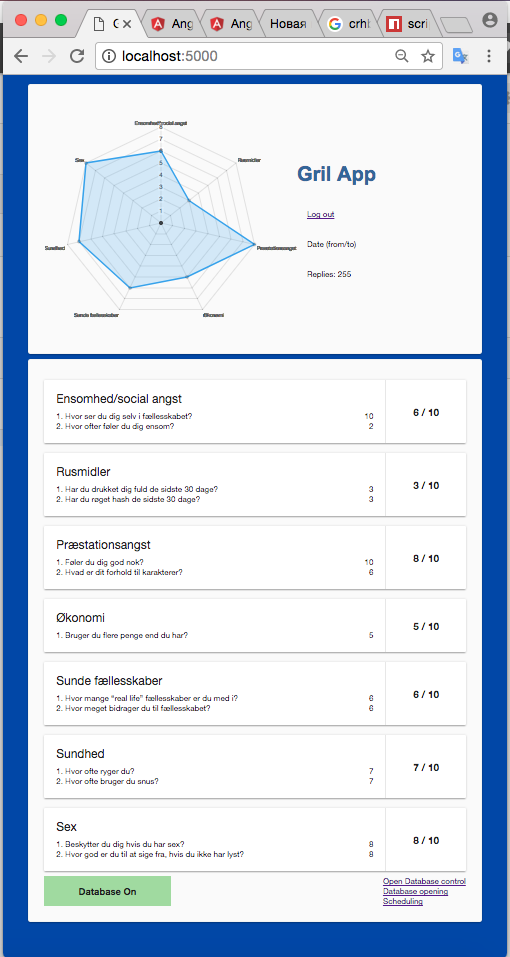

# Install Dependencies
npm install

# Start Api Server
nodemon app.js

# Build Angular App

cd front-webpack-angular2

npm run build
 or
npm run build:watch

# Route 
POST: localhost:5000/answers
GET: localhost:5000/reports

