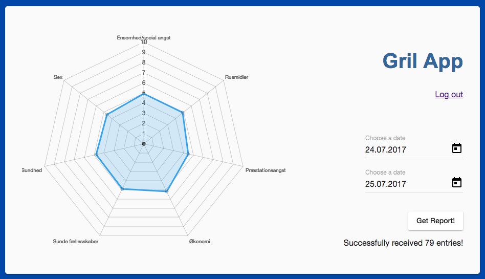
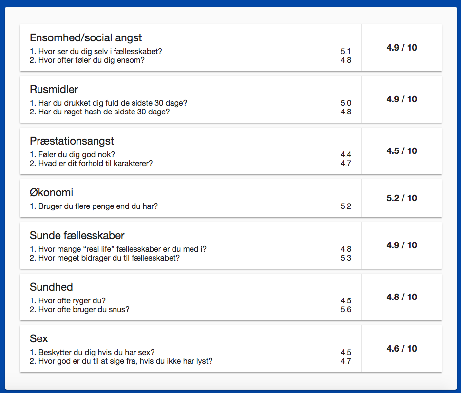
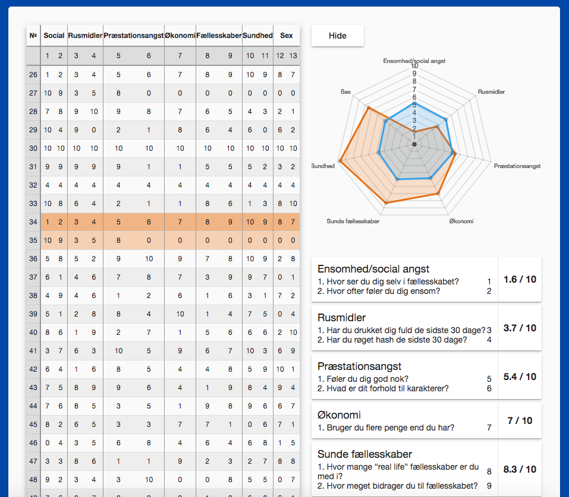

# Install Dependencies
npm install:dev

# Start Api Server - Dev, Watch
npm start

# Build Angular App

cd front-webpack-angular2

npm run build
 or
npm run build:watch

# Route 
POST: localhost:5000/answers
GET: localhost:5000/reports

# Screen

# Init sequelize 
sequelize init

# Create User Model
sequelize model:create --name User --attributes 'name:string, email:string, password:string, isAdmin:boolean'
This will create
- models/users.js
- migration/*create-user.js

# Create Answers Model
sequelize model:create --name Answer --attributes 'society:integer, lonely:integer, drink:integer, hash:integer, feel:integer, relation:integer, economy:integer, community:integer, contribute:integer, smoke:integer, snus:integer, sex:integer, deny:integer'

#Create DB Control
sequelize model:create --name ControlDb --attributes 'date:date, access:boolean'

# Migrate DB
sequelize db:migrate

# Seeders
sequelize seed:create

sequelize db:seed:all